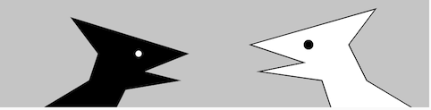

# Introduction

[](https://editor.p5js.org/jht1493/sketches/sxI2SjRrh)

# Your Coding Journey

## Challenges
- learning to think like the computer
  - thinking in numbers
  - understanding flow, order of operations
- making the invisible visible  
  - time
  - state

## Strategies
- re-mix and experiment with sketches
- create your own summary sheet of p5js terms as you use them
- draw pictures
- if you get stuck, document the issues
  - duplicated your sketch, add issues as comments
  - bring your sketch to class and ask for help

# 1. Recap, Explore and Experiment

Let's recap, explore, and experiment with the concepts introduced in this session.

- draw a rough schematic of what you've learned so far about p5js
- after you finish these exercises redraw with any new insights

So far our sketches define functions `setup` and `draw`.
The function `setup` is called once when we hit the play button,
and the function `draw` is called repeatedly until we hit the stop button.
Also we haved used functions defined by the p5js library,
like `ellipse` and `rect`, to draw shapes on the canvas.

In these exercises we'll explore 
- how to create buttons to run code   
- how to use the print function to debug your code   
- the behavior of alpha value for colors   
- how to define your own functions   

For these sketches no drawing is done in the function `draw`. Drawing will be trigger by clicking on buttons.
When nothing is drawn the canvas will start out white.

## Ex 1.1 play sketch draw_rect

[sketch - draw_rect](https://editor.p5js.org/jht1493/sketches/WJFtFBmnK) Open this sketch in a separate window so that you can play it and read this page at the same time.


- if your screen too small to allow viewing sketch and this page at the same time, 
use a print out this page as you explore the sketch.
- buttons will appear below canvas

This sketch defines buttons to draw on the screen. 
Here's the code that defines one of the buttons and its action:

```
  createButton('backg 240').mousePressed(function() {
    background(240);
  });
```

We'll getting into details of how to create your own button later.
For now we'll use buttons to explore p5js drawing behavior.

- play the sketch, click on the buttons in different orders and note behavior

### Questions

- did you notice that sometimes the left rect can be white or gray? 
    - if the answer is not clear bring as question to class

- what are possible ways to represent color for function [`fill`](https://p5js.org/reference/#/p5/fill)?

### Try

- try adjusting the colors specified in calls to function `fill`

## Ex 1.1 explore sketch draw_rect_print

In this sketch the function [`print`](https://p5js.org/reference/#/p5/print) 
is added so that we can follow the execution of the buttons in the console.

[sketch - draw_rect_print](https://editor.p5js.org/jht1493/sketches/NlCr2UD2P) Open this sketch in a separate window so that you can play it and read this page at the same time.

Code that uses the function `print` to help debug:
```
  createButton('backg 240').mousePressed(function() {
    print('calling background');
    background(240);
  });
```

### Try

- try setting different colors for each shape, eg:
- try `fill(100)`
- try `fill(100,20)`

In p5js a color can be represent in a number of ways.
Here are a few:

- color name, eg: 'white', 'black', 'red', 'green', 'yellow', 'blue'

- gray scale number, eg: 0 (white), 128 (gray), 255 (black)

- red, green, blue, alpha, eg: 255, 0, 0, 100 is full red with medium alpha setting. 

## Ex 1.1 explore sketch draw_rect_alpha

In this sketch alpha values are used for colors.

[sketch - draw_rect_alpha](https://editor.p5js.org/jht1493/sketches/6mrwOv4RD) Open this sketch in a separate window so that you can play it and read this page at the same time.

This sketch uses the Red, Green, Blue, Alpha format for colors. 
The values Red, Green, Blue and Alpha are numbers between 0 and 255. 
The alpha value can range from 0 (no alpha, white color), to 255 (full value of the color components). 
For example, alpha value 127 will mix an even amount of the background color with the fill color.
Alpha value 20 will give a very light tint of the fill color on the background.

### Try

- try clicking each button repeatedly and observe the laying of the colors

- try low values of alpha eg. 10, and compare to medium alpha value eg. 100

## Ex 1.1 explore sketch draw_rect_createSpan

In this exercise a few other functions are added
to explore the p5js canvas coordinate system, shapes, and color.

[sketch - draw_rect_createSpan](https://editor.p5js.org/jht1493/sketches/C83N_DY9w) Open this sketch in a separate window so that you can play it and read this page at the same time.

### Questions

- when do the numbers change and when don't they change?

- what is the lowest value for mouseX within the canvas area?

- what is the largest value for mouseX within the canvas area?

- what value in the code will change the width of the canvas?

- what color values are reported for different areas on the canvas?

## Ex 1.2 explore sketch draw_shapes_body 

[sketch - 1.2 draw_shapes_body](https://editor.p5js.org/jht1493/sketches/X5iRxm8HK) Open this sketch in a separate window so that you can play it and read this page at the same time.

Click on the buttons and observe the actions and the messages that appear in the console.
In the body of the mousePressed function you can call as many other functions as you wish.

- buttons Rect and Circle not color is set

- button Shapes draws 3 shapes:
```
  createButton('Shapes').mousePressed(function() {
    print('drawing shapes');
    // fill(red, green, blue, alpha)
    fill(255, 0, 0, 20); // Red, alpha 20
    rect(0, 100, 200, 200);
    // fill(red, green, blue, alpha)
    fill(255, 255, 0, 20); // Yellow, alpha 20
    circle(200, 200, 200)
    // fill(red, green, blue, alpha)
    fill(0, 255, 0, 20); // Green, alpha 20
    rect(200, 100, 200, 200);
  });
```

## Ex 1.2 explore sketch draw_shapes_func

[sketch - 1.2 draw_shapes_func](https://editor.p5js.org/jht1493/sketches/qEgdTdx0K) Open this sketch in a separate window so that you can play it and read this page at the same time.

Click on the buttons and observe the actions and the messages that appear in the console.

Let's look at the definition of function draw_shapes:

```
function draw_shapes() {
  // fill(red, green, blue, alpha)
  fill(255, 0, 0, 20); // Red
  rect(0, 100, 200, 200);
  // fill(red, green, blue, alpha)
  fill(255, 255, 0, 20); // Yellow
  circle(200, 200, 200)
  // fill(red, green, blue, alpha)
  fill(0, 255, 0, 20);  // Green
  rect(200, 100, 200, 200);
}
```

Unlike the functions we've seen so far, 
function `draw_shapes` is not part of p5js library.
function `draw_shapes` and it's definition is written for this exercise.
The name is choosen to be descriptive of what the function supposed to do.
You are encouraged to write functions to break up your code into meaningful units.
I prefer to use the underscore characters in names 
I create to distinguish them from built-in p5js/javascript names.

In this sketch function `draw_shapes` is called from 
the button 'Shapes' defined in the function setup:

```
function setup() {
  ...
  createButton('Shapes').mousePressed(function() {
    print('calling draw_shapes');
    draw_shapes();
  });
  ...
}
```

- You choose the name for your functions names to describe the intent of the code
- A function name must begin with a letter (upper or lower case), 
followed by any number of letters, numbers or underscore characters.

### Questions

- what happens if you repeatedly click on button Shapes? why?

- what happens if you click on buttons Rect or Circle after button Shapes? why?

## Ex 1.2 explore sketch draw_shapes_ui

[sketch - 1.2 draw_shapes_ui](https://editor.p5js.org/jht1493/sketches/DGQoBYV9x)
 Open this sketch in a separate window so that you can play it and read this page at the same time.

- added function create_ui and function update_ui 
- code is re-used from previous sketch to display mouse location and canvas color

### Try

- add or change shapes drawn in function draw_shapes

- add other buttons to draw other shapes

## What have you learn?

- draw your own schematic of p5js - illustrate what you've learned so far
- [my p5js schematic]()

## What's next?

- wouldn't it be cool if we could animate our drawing?
- or create patterns with our shapes? 
- next up animation and variables!

## DOM functions `createButton`, `createSpan`, `select`

- curious about functions `createButton`, `createSpan`, `select`? (if not, ok to skip this section)
- these are DOM functions
- DOM means Document Object Model - how the browser refers to visual elements on the page
- functions `createButton`, `createSpan`, and `select` manage DOM elements
- function `createButton` creates a button element on the page
- function `createSpan` creates a container for text, spans are layed out on a line
- function `select` is used to referred to an element by it's id
- elements may be assigned an id which is later used to reference them
- an id is descriptive text you make up

- the canvas itself is DOM element!

- in future sessions we'll see how to adjust layout of DOM elements

### to make a button
- copy paste code for `createButton`
- change button title and body

```
function setup() {
  createCanvas(400, 300);
  // createButton('title-for-button-')...
  createButton('backg 240').mousePressed(function() {
    // Code to run when button pressed, the "body"
    background(240);
  }); // End of createButton
...
```

### to display a value
- copy paste code for `createSpan` and `select`
- replace parameter to `id`, `select` and `html`

```
  // setup code
  // first parameter 'imx' is id for span
  // replace with your string
  createSpan().id('imx');

  // draw code
  // replace string imx with your id
  // parameter '#imx' is id for span. character # is required
  select('#imx').html('[mouseX='+mouseX+'] ')
```

[](https://editor.p5js.org/jht1493/sketches/mPX1b9278)
