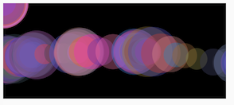

# Animation: Variables

[ ](https://editor.p5js.org/jht1493/sketches/wJCzyVzBm)

# Your Coding Journey

# 2. Recap, Explore and Experiment

Let's recap, explore, and experiment with the concepts introduced in this session.

-------------------------------------------------------------------------------
## 2.1 mouseX and mouseY

[sketch - p5js Code! - 2.1 - mouseX,mouseY](https://editor.p5js.org/codingtrain/sketches/IeblvUQrf) Open these sketch in a separate window so that you can play it and read this page at the same time.

This sketch from the video uses the p5js variables `mouseX` and  `mouseY` to draw circles on the canvas. Code in the function `mousePressed` causes the canvas to be black whenever mouse is pressed anywhere on the page. A circle is drawn when the mouse moves over the canvas.

```
function draw() {
  noStroke();
  fill(255, 50);
  circle(mouseX, mouseY, 24);
}

function mousePressed() {
  background(0);
}
```

Let's re-mix this sketch and spice it up a little using basic arithmatic.

### mouseDragged

[sketch - 2.1.2 mouseX,mouseY](https://editor.p5js.org/jht1493/sketches/KaijsTyVc)

To have drawing happen only when the mouse button is pressed and moved, we define [function mouseDragged](https://p5js.org/reference/#/p5/mouseDragged).

```
function mouseDragged() {
  circle(mouseX, mouseY, 24);
}
```

### arithmatic on mouseX

[sketch - 2.1.2 mouseX,mouseY arith](https://editor.p5js.org/jht1493/sketches/pmA0d9Uqt) Two circles are drawn when the mouse moves in this sketch.

We can draw multiple shapes based on the mouse location using the some basic arithmatic. 

```
function mouseDragged() {
  circle(mouseX-25, mouseY, 24);
  circle(mouseX+25, mouseY, 24);
}
```

### Try

- adding other shapes to draw when the mouse is dragged.

### Try

- as one shape is drawn, an other shape is drawn to mirror it

[sketch - 2.1.2 mouseX mirror](https://editor.p5js.org/jht1493/sketches/C2bgbELqa)

### Try

- Add ui elements to control color and give feedback about mouse location and canvas color. Borrow code from previous session.

[sketch -  2.1.4 mouseX,mouseY ui](https://editor.p5js.org/jht1493/sketches/I8zejgYIX)

-------------------------------------------------------------------------------
## 2.2 Variables circleX

[sketch - make your own variable](https://editor.p5js.org/codingtrain/sketches/xPXNdPy17)  

In this sketch the variable circleX is used to control the location of the circle. The circle will move to the right indefinately. We'll use the math operator remainder to have the circle jump back to the left after it has passed the right edge of the canvas.

The remainder operator will give the remainder when a number is divided by another.
The net effect is that one value can be use to limit another value.
Some examples:
```
1 % 3 // result is 1, 1 divided by 3 is 0, remainder 1
4 % 3 // result is 1, 4 divided by 3 is 1, remainder 1
5 % 3 // result is 2, 5 divided by 3 is 1, remainder 2
x % n // result is always between 0 and n-1
```

[sketch - 2.2.1 circleX width](https://editor.p5js.org/jht1493/sketches/CwYDz_4N2)   

- variable circleX is incremented and limited to the range 0 ... width
- when the value circleX + 1 equals width the result will be clipped to 0

```
  circleX = (circleX + 1) % width;
```

### Try

- add another shape that moves top to bottom

[sketch - 2.2.1 shape1 shape2 ](https://editor.p5js.org/jht1493/sketches/cuaGTyRYU)   

### Try

- re-mix [sketch - growing circle](https://editor.p5js.org/codingtrain/sketches/ehbMJ-otC) use the remainder operator to limit the circle growth

[sketch - 2.2.3 circleR growing](https://editor.p5js.org/jht1493/sketches/2ZGRl9x1p)  

### Try

- remix [sketch - 2.2.1 variable...](https://editor.p5js.org/jht1493/sketches/CwYDz_4N2) with buttons to change the diameter of the circle

[sketch -  2.2.4 circleX width ui](https://editor.p5js.org/jht1493/sketches/UhNMB6GQO)   

### Try

- disable background drawing and play with alpha colors

- add buttons to change colors

- add button for random color

[sketch - 2.2.5 variable circleX rgb](https://editor.p5js.org/jht1493/sketches/mDleb9mKk)   

-------------------------------------------------------------------------------
## 2.3 Incrementing variables

These examples uses this coding pattern to create animation: A variable, circleX, is updated by increment its value. There is an illusion of motion as the shape is drawn one pixel to the right each time the `function draw` is called.

```
  circleX = (circleX + 1) % width;
```

We could increase the apparent speed of this animation by adding a value greater than 1:

```
  circleX = (circleX + 2) % width;
```

By increment by 2 the shape will move faster.

### Try

- create a new variable that controls the speed of the animation

- create a second shape that animates across the screen at a different speed

[2.3.1 shape1 shape2 speed](https://editor.p5js.org/jht1493/sketches/IuKS1TIjB)

-------------------------------------------------------------------------------
## 2.4 [function random()](http://p5js.org/reference/#/p5/random)

The random function is a versatile function that can add variety to our sketches.
We've seen it used to produce a random number with in a range:
```
// x will be a random number between width/2 and width
// ie. the right half of the canvas
let x = random(width/2,width);
```
We can also get a less random selection by using an `array` of values. An array is a series of values enclosed in square brackets. In future session we'll get deeper into creating and modifing arrays. For now we'll use them as a source for values.

```
// x will be one of 10,20,100,200
let x = random([10,20,100,200]);
// col will be one of 'red', 'green' or 'yellow'
let col = random(['red','green','yellow']);
```

The array notation can also be used to specify colors with alpha values:
```
let cRed = [255,0,0,10];
let cGreen = [0,255,0,10];
let cYellow = [255,255,0,10];
// pick a random color value
let col = random([cRed,cGreen,cYellow]);
```

### Try

- remix one of the circleX sketches to change to random color when the canvas is clicked.

[2.4.1 random shape1](https://editor.p5js.org/jht1493/sketches/N2VJYjIWg)


### Try

- use alpha color values with a moving shape

[2.4.2 shape1 alpha](https://editor.p5js.org/jht1493/sketches/UDMyivHEQ)

-------------------------------------------------------------------------------
## Getting Started with p5.js book

The `Getting Started book` has many useful sketches. You're invite to remix and combine them to further explore drawings in motion.

  * Chapter 4 through Ex. 4.5

[Ex_04_04 Basic Arithmetic](https://editor.p5js.org/jht1493/sketches/Eg01Z5WpY)  
[Ex_04_05 Do the Same](https://editor.p5js.org/jht1493/sketches/nUqcuwlY9)   
[Ex_04 Robot 2: Variables](https://editor.p5js.org/jht1493/sketches/mJ_X4q47O)  
[Ex_04 Robot 2: Variable func](https://editor.p5js.org/jht1493/sketches/cyyCJGXOz) -remix-    
[Ex_04 Robot 2: func jiggle](https://editor.p5js.org/jht1493/sketches/D3QUVpQhx) -remix-  

  * Chapter 8 through Ex. 8.9

[Ex_08_03 Move a Shape](https://editor.p5js.org/jht1493/sketches/DJ99paBR7)	  
[Ex_08_04 Wrap Around](https://editor.p5js.org/jht1493/sketches/W_nCg2LI2)   
[Ex_08_05 Bounce Off the Wall](https://editor.p5js.org/jht1493/sketches/wJCzyVzBm)  
[Ex_08_06 Tween](https://editor.p5js.org/jht1493/sketches/vJUCok9aU)   
[Ex_08_06 Tween mouse](https://editor.p5js.org/jht1493/sketches/W11fu5LhG) -remix-  
[Ex_08_08 Draw Randomly](https://editor.p5js.org/jht1493/sketches/SmFX6Ioj_)   
[Ex_08_09 Move Shapes Randomly](https://editor.p5js.org/jht1493/sketches/YjFnLREL7)	

### Going futher

  * Going further: Chapter 6 (Transformations) 

[Ex_06_01 Translating Location](https://editor.p5js.org/jht1493/sketches/P2GfFz2Jv)   
[Ex_06_02 Multiple Translations](https://editor.p5js.org/jht1493/sketches/aNTyhkTAp)   
[Ex_06_03 Corner Rotation](https://editor.p5js.org/jht1493/sketches/7tw-3XmNx)   
[Ex_06_04 Center Rotation](https://editor.p5js.org/jht1493/sketches/-K5nIPw-O)   
[Ex_06_05 Translation Rotation](https://editor.p5js.org/jht1493/sketches/dIUreb8Fc)   
[Ex_06_06 Rotation Translation](https://editor.p5js.org/jht1493/sketches/f61txC7KZ)   
[Ex_06_07 Articulating Arm](https://editor.p5js.org/jht1493/sketches/NqUbfaE2H)   
[Ex_06_08 Scaling](https://editor.p5js.org/jht1493/sketches/TSDh4otF5)   
[Ex_06_09 Strokes Consistent](https://editor.p5js.org/jht1493/sketches/Iy6KGB3Wf)   
[Ex_06_10 Isolating Transformations](https://editor.p5js.org/jht1493/sketches/6vFu9X3jD)   
[Ex_06_99 Robot 4: Translate](https://editor.p5js.org/jht1493/sketches/yGDQyWCf7)   
[Ex_06_99 Robot 4: Translate func](https://editor.p5js.org/jht1493/sketches/7TS45L2cA) -remix-  

  * Going further: Chapter 8.10-8.15 (More complex motion)

[Ex_08_10 Time Passes](https://editor.p5js.org/jht1493/sketches/BoVBnl443)   
[Ex_08_11 Triggering Timed](https://editor.p5js.org/jht1493/sketches/xADLvN6tz)   
[Ex_08_12 Sine Wave Values](https://editor.p5js.org/jht1493/sketches/B4P8dpKW5)   
[Ex_08_13 Sine Wave](https://editor.p5js.org/jht1493/sketches/U80HMnJYf)   
[Ex_08_14 Circular Motion](https://editor.p5js.org/jht1493/sketches/0IZtaK_fH)   
[Ex_08_15 Spirals](https://editor.p5js.org/jht1493/sketches/nAiwy2Qte)   
[Ex_08_99 Robot06_Motion](https://editor.p5js.org/jht1493/sketches/GD_kzWHeR)   

[  ](https://editor.p5js.org/jht1493/sketches/OLzJZWjV5)
