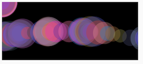

# Animation: Variables

[ ](https://editor.p5js.org/jht1493/sketches/wJCzyVzBm)

# Your Coding Journey

# 2. Recap, Explore and Experiment

Let's recap, explore, and experiment with the concepts introduced in this session.

  * [video 2.1: Variables in p5.js (mouseX, mouseY)](https://thecodingtrain.com/beginners/p5js/2.1-mousex-mousey.html) (~11 min)
  * [sketch](https://editor.p5js.org/codingtrain/sketches/IeblvUQrf)

Flow of code.
function mousePressed() {
}

https://editor.p5js.org/codingtrain/sketches/IeblvUQrf   
p5js Code! - 2.1 - mouseX,mouseY

!!@ Need arith to do suggestions

// https://editor.p5js.org/jht1493/sketches/KaijsTyVc   
// 2.1.1 mouseX,mouseY

function mouseDragged() {
  circle(mouseX, mouseY, 24);
}

// https://editor.p5js.org/jht1493/sketches/pmA0d9Uqt   
// 2.1.2 mouseX,mouseY arith

>> a value can be an arithmetic expression
function mouseDragged() {
  circle(mouseX-25, mouseY, 24);
  circle(mouseX+25, mouseY, 24);
}

// https://editor.p5js.org/jht1493/sketches/5Q_M3rwpt   
// 2.1.3 mouseX,mouseY left

>> intro remainder
function mouseDragged() {
  circle(mouseX % 200, mouseY, 24);
}

// https://editor.p5js.org/jht1493/sketches/I8zejgYIX   
// 2.1.4 mouseX,mouseY ui

>> ui added
>> Replace mousePressed with mouseDragged
>> button backg 0
>> button random

>> Try: draw 4 circles around mouse location

>> Try: write functions to draw other shapes call them from mouseDragged


// https://editor.p5js.org/jht1493/sketches/tNEJXRA1V   
// 2.1 mouseX,mouseY funcs

>> Try: remainder for x-symmetry


// https://editor.p5js.org/jht1493/sketches/v56Rd_pWx   
// 2.1 mouseX,mouseY mirror
function mouseDragged() {
  circle(mouseX % 200, mouseY, 24);
  circle(width - (mouseX % 200), mouseY, 24);
}

>> Try: use raminder to get Y-symmetry

-------------------------------------------------------------------------------

  * video 2.2: Variables in p5.js (Make your own)

  * [video 2.2: Variables in p5.js (Make your own)](https://thecodingtrain.com/beginners/p5js/2.2-make-your-own.html) (~11 min)
  * [sketch - make your own variable](https://editor.p5js.org/codingtrain/sketches/xPXNdPy17)
  * [sketch - growing circle](https://editor.p5js.org/codingtrain/sketches/ehbMJ-otC)


variable:
- declare
- init
- use

global variables
all at the top of script
let circleX = 100;

increment
circleX = circleX + 1;

>> ?? slider for alpha
  interesting values are low, slide not helpful
>> slider for brush size ??
>> Try: buttons for circle size

// !!@ Expand on expresions
circleX = (circleX + 1) % width;

https://editor.p5js.org/codingtrain/sketches/xPXNdPy17   
p5js Code! - 2.2 - make your own variable

  circle(circleX, 150, 64);
  circleX = circleX + 1;

>> mouse presssed out side of canvas will reset

// https://editor.p5js.org/jht1493/sketches/v9zsQFPqN   
// 2.2 variable circleX

  createCanvas(400, 300).mousePressed(function() {
    circleX = 0;
  });

>> mouse presssed on canvas only to reset circleX

function mousePressed() {

// https://editor.p5js.org/jht1493/sketches/CwYDz_4N2   
// 2.2.2 variable circleX % width

>> variable restricted to 0 ... width
  circleX = (circleX + 1) % width;

// https://editor.p5js.org/jht1493/sketches/UhNMB6GQO   
// 2.2.3 variable circleX % width ui

>> ui added. add buttons to change circleX and/or circleY

// https://editor.p5js.org/jht1493/sketches/YzI6wqRG   
2.2.3 variable circleX random color

>> Try: no background

>> Try: buttons to change color of shape

// https://editor.p5js.org/jht1493/sketches/mDleb9mKk   
// 2.2.4 variable circleX rgb


-------------------------------------------------------------------------------
* The [random()](http://p5js.org/reference/#/p5/random) function
  * [video 2.5: random()](https://www.youtube.com/watch?v=nfmV2kuQKwA&list=PLRqwX-V7Uu6Zy51Q-x9tMWIv9cueOFTFA&index=9)


>> limit to fix set of colors

```
Use: array of values in   
https://p5js.org/reference/#/p5/random   
  random(choices) 
  choices Array: the array to choose from
https://p5js.org/reference/#/p5/fill
  fill(values)
  values Number[]: an array containing the red,green,blue & and alpha components of the color
```

// https://editor.p5js.org/jht1493/sketches/jZtF7e5E5   
// 2.5.2 random spot.count ui col set
```
let col_set = [
  [255, 0, 0, a_alpha],
  [0, 255, 0, a_alpha],
  [255, 255, 0, a_alpha],
  [0, 0, 0, a_alpha],
  // [255, 255, 255, a_alpha]
];

  let col = random(col_set);
  col[3] = a_alpha;

    frameRate(0);

    frameRate(10);
```
-------------------------------------------------------------------------------
  * [Rainbow Paintbrush in p5.js](https://medium.com/@kellylougheed/rainbow-paintbrush-in-p5-js-e452d5540b25) by Kelly Lougheed

>> Added sketch   

// https://editor.p5js.org/jht1493/sketches/9aYZcF6DM   
// 2.5 Rainbow Paintbrush
```
  a_hue = (a_hue + 10) % 360;
```
// https://editor.p5js.org/jht1493/sketches/dojCKsdwQ   
// 2.5 Rainbow Paintbrush ui

// https://editor.p5js.org/jht1493/sketches/TAnGTwIJ1   
// 2.5.3 Rainbow Paintbrush a_step

-------------------------------------------------------------------------------

## p5.js editor examples
  * [random painting](
https://editor.p5js.org/icm/sketches/HJg8jfcT3   

https://editor.p5js.org/jht1493/sketches/sUEajcpKC   
2. Random Painting noStroke   
>> !!@ try: cycle circle size   
>> !!@ try: lower alpha   
>> !!@ try: cycle alpha   
>> !!@ try: othe shapes   

  * [mouse controlled painting](   
https://editor.p5js.org/icm/sketches/r1JeQqa3   

  * [moving circle](   
https://editor.p5js.org/icm/sketches/Bymv7ca2   
>> Try: use mousePressed function to set new color and x, y to mouseX, mouseY   
// https://editor.p5js.org/jht1493/sketches/QfgP2VgJt   
// 2.9 moving circle random set   

// https://editor.p5js.org/jht1493/sketches/IiHPr9gcV   
// 2.9 moving circle   

  * [clock](https://editor.p5js.org/icm/sketches/ryYueiWu7) -- [Clock coding challenge video](https://youtu.be/E4RyStef-gY)

-------------------------------------------------------------------------------
## Getting Started with p5.js book

  * Chapter 4 through Ex. 4.5
    * [sketches](https://editor.p5js.org/jht1493/collections/yH3IYcxzz)

[Ex_04_04 Basic Arithmetic](https://editor.p5js.org/jht1493/sketches/Eg01Z5WpY)  
[Ex_04_05 Do the Same](https://editor.p5js.org/jht1493/sketches/nUqcuwlY9)   
Ex_04 Robot 2: Variables  
Ex_04 Robot 2: Variable func  
Ex_04 Robot 2: func jiggle  

  * Chapter 8 through Ex. 8.9
    * [sketches](https://editor.p5js.org/jht1493/collections/a0FX7oZfY)

Ex_08_03 Move a Shape	  
Ex_08_04 Wrap Around   
Ex_08_05 Bounce Off the Wall  
Ex_08_06 Tween   
Ex_08_08 Draw Randomly   
Ex_08_09 Move Shapes Randomly	

  * Going further: Chapter 6 (Transformations) 
    * [sketches](https://editor.p5js.org/jht1493/collections/LyMXjpqPV)

Ex_06_01 Translating Location   
Ex_06_02 Multiple Translations   
Ex_06_03 Corner Rotation   
Ex_06_04 Center Rotation   
Ex_06_05 Translation Rotation   
Ex_06_06 Rotation Translation   
Ex_06_07 Articulating Arm   
Ex_06_08 Scaling   
Ex_06_09 Strokes Consistent   
Ex_06_10 Isolating Transformations   
Ex_06_99 Robot 4: Translate   

  * Going further: Chapter 8.10-8.15 (More complex motion)
    * [sketches](https://editor.p5js.org/jht1493/collections/a0FX7oZfY)

Ex_08_10 Time Passes   
Ex_08_11 Triggering Timed   
Ex_08_12 Sine Wave Values   
Ex_08_13 Sine Wave   
Ex_08_14 Circular Motion   
Ex_08_15 Spirals   
Ex_08_99 Robot06_Motion   


[](https://editor.p5js.org/jht1493/sketches/OLzJZWjV5)
