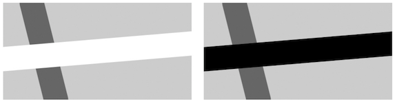
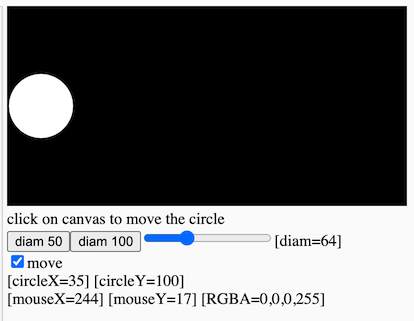
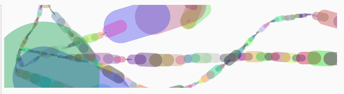

# 3. Interaction: Conditionals

[](https://editor.p5js.org/jht1493/sketches/hV0JF0uwo)

<!-- 
https://docs.google.com/document/d/14iC_LoImN-RUQumYrOLWjEk24q-KXBzEh0cJoN3Dy3I/edit
JHT Week 3 Worksheet
 -->

<!-- *The videos in this section were created ~2 years ago. They use different editors for p5.js. All of the concepts should still apply, however, there are some minor changes. Most notably in JavaScript `let` is now the preferred way to declare a variable over `var`. If you would like to learn more about this you can [watch this video about let vs var](https://youtu.be/q8SHaDQdul0).* -->

<!-- >> ?? move this comment to video page -->
<!-- >> ?? recommend reading before watching videos -->
<!-- >> guided copy-and-paster: re-mix is ok, start with best practices -->

## Conditional Statements
* [video 3.1: Introduction to Conditional Statements ](https://thecodingtrain.com/beginners/p5js/3.1-conditional-statements.html) (~12 min)
  * `if` statement
  * relational operators (`>`, `<`, `<=`, `>=`, `==`, `===`, `!==`)
  * [sketch - if mouseX](https://editor.p5js.org/codingtrain/sketches/z_yjYIha)
* [video 3.2: Bouncing Ball](https://thecodingtrain.com/beginners/p5js/3.2-bouncing-ball.html) (~8 min)
  * [sketch - bouncing ball x](https://editor.p5js.org/codingtrain/sketches/Xm4cmQvU) <!-- >> does not bounce!! -->
  * [sketch - bouncing ball xy](https://editor.p5js.org/icm/sketches/BJKWv5Tn)
  <!-- >> bounces x and y -->
  <!-- >> simpler example that does with going off on left -->
  <!-- println -> console.log -->
* [video 3.3: else, else if, and, or](https://thecodingtrain.com/beginners/p5js/3.3-else-elseif-and-or.html) (~17 min)
  <!-- * [sketch - if mouseX](https://editor.p5js.org/codingtrain/sketches/In-bIB8w) -->
  * [sketch - if mouseX AND](https://editor.p5js.org/jht1493/sketches/pK7xE8hN3)
  * [sketch - else if](https://editor.p5js.org/jht1493/sketches/VmJD4ZUMJ)
  * [sketch - bounce ball x OR](https://editor.p5js.org/jht1493/sketches/G1WHVQsRV)
  * [sketch - bounce ball x OR ui](https://editor.p5js.org/jht1493/sketches/h0ZJWwOzb)
  <!-- code commented out in sketch -->
  <!-- mentions updating bounceing bacll and other sketch -->
  <!-- else if not essential -->
  <!-- >> ?? add better example -->
  <!-- otherwise -->
* [video 3.4: Boolean variables](https://thecodingtrain.com/beginners/p5js/3.4-boolean-variables.html) (~20 min)
  <!-- * [sketch - Boolean variables](https://editor.p5js.org/codingtrain/sketches/yzBpV0CI) !!@ Does not match video -->
  * [sketch - Boolean variables](https://editor.p5js.org/jht1493/sketches/1IcyZZamQ)
  <!-- sketch correct to match video -->
  <!-- >> ?? no Boolean variables used in sketch -->
  <!-- mouseIsPressed variable
  // change state of program
  // toggle boolean value
  on = !on; -->

<!-- 3.1: Introduction to Conditional Statements - video tutorial -->
<!-- https://www.youtube.com/watch?v=1Osb_iGDdjk&list=PLRqwX-V7Uu6Zy51Q-x9tMWIv9cueOFTFA&index=10 -->
<!-- 3.2: Bouncing Ball - video tutorial -->
<!-- https://www.youtube.com/watch?v=LO3Awjn_gyU&list=PLRqwX-V7Uu6Zy51Q-x9tMWIv9cueOFTFA&index=11 -->
<!-- 3.3: `else`, `else if`, AND (`&&`), OR (`||`) - video tutorial -->
<!-- https://www.youtube.com/watch?v=r2S7j54I68c&list=PLRqwX-V7Uu6Zy51Q-x9tMWIv9cueOFTFA&index=12 -->
<!-- 3.4: Boolean variables - video tutorial -->
<!-- https://www.youtube.com/watch?v=Rk-_syQluvc&list=PLRqwX-V7Uu6Zy51Q-x9tMWIv9cueOFTFA&index=13 -->

## Getting Started with p5.js book
* Chapter 5. Response
  * [sketches](https://editor.p5js.org/jht1493/collections/u8b97q_m7)
* [Getting Started with p5.js book](http://amzn.to/2ckixCW) 
  * [Ebook (free with NYU Library login)](https://ebookcentral.proquest.com/lib/nyulibrary-ebooks/detail.action?docID=4333728) 
  * [git source code](https://github.com/lmccart/gswp5.js-code)


## GUI Interfaces
One way to practice working with conditionals is to try to code a common interface elements in the canvas: e.g. rollover, button, slider, etc. 
<!-- In [week 6](https://github.com/ITPNYU/ICM-2018/blob/master/weeks/06_dom.md) we'll compare this technique to using elements the browser provides for free. -->
- [sketch - circle rollover](https://editor.p5js.org/icm/sketches/H1kCSqah)
- [sketch - square rollover](https://editor.p5js.org/icm/sketches/rkLfL56h)
- [sketch - button hold down](https://editor.p5js.org/icm/sketches/S16-H9pn)
- [sketch - button switch](https://editor.p5js.org/icm/sketches/Sywrrqa2)
- [sketch - quadrant rollover](https://editor.p5js.org/icm/sketches/Hki1I5ah)
- [sketch - rollover with fade](https://editor.p5js.org/icm/sketches/SkPsHcph)
- [sketch - draggable](https://editor.p5js.org/icm/sketches/B13wH5T3)
- [sketch - knob](https://editor.p5js.org/icm/sketches/HkfFHcp2)
- [sketch - slider](https://editor.p5js.org/icm/sketches/H1LXU9ah)

<!-- >> some not easy to reuse this code. Drop?? -->
<!-- better to show if and variables used with DOM -->

[](https://editor.p5js.org/jht1493/sketches/hV0JF0uwo)

-------------------------------------------------------------------------------
# 3. Recap, Explore and Experiment - Interaction: Conditionals

>> [] !!@ TODO  
>> need to develop algorithm   
>> process that must be expressed in operations on variables over time  
>> need to visualize state and time  
>> pseudo-code -> comments  

>> replace % width with if check  
>> state tables   
>> boolean tables AND OR NOT
>> breaking long expressions with temp variables  
>> your code as a story with characters (variables)   
>> script is the code in sketch -- plot line -- time  
>> characters can only say one told to remember one thing  
>> and asked to repeat it  

>> intro `while` as way to draw entire frame on each draw call  

Dig into to explain use of DOM to make variables visible  
[](https://editor.p5js.org/jht1493/sketches/uGy4cEzbs)  
[sketch - 3.1 circleX width ui lib](https://editor.p5js.org/jht1493/sketches/uGy4cEzbs)
<!-- >> slider ui + read out ui -->
<!-- check box ui -->

```
let a_move = true;
...
  if (a_move) {
    circleX = (circleX + 1) % width;
  }
...
  // createCheckbox([label], [value])
  createCheckbox('move', a_move).changed(function() {
    a_move = this.checked();
  });

```

```
let diam = 64;
...
  circle(circleX, circleY, diam);
...
  createButton('diam 50').mousePressed(function() {
    diam = 50;
  });
...
  // createSlider(min, max, [value], [step])
  createSlider(0, 200, diam).input(function() {
    diam = this.value();
  });
```

```
  createSpan().id('idiam');
...
  select('#idiam').html('[diam=' + diam + '] ')
```

-------------------------------------------------------------------------------
## Getting Started with p5.js book sketches

Sketches from the [Getting Started book](http://amzn.to/2ckixCW).  
You are invited to remix and combine them to further explore.

- Chapter 5 Response

[Ex_05_01 frameCount](https://editor.p5js.org/jht1493/sketches/QrE5pO6E9)  
[Ex_05_02 setup draw](https://editor.p5js.org/jht1493/sketches/rts0Rja8o)  
[Ex_05_03 setup, Meet draw](https://editor.p5js.org/jht1493/sketches/T04uHthwa)  
[Ex_05_04 Track the Mouse](https://editor.p5js.org/jht1493/sketches/4pysTdayc)  
[Ex_05_05  The Dot Follows You](https://editor.p5js.org/jht1493/sketches/rc_stJwOF)  
[Ex_05_06 Draw Continuously](https://editor.p5js.org/jht1493/sketches/d2VusUGT4)  
[Ex_05_07 Set Thickness on the Fly](https://editor.p5js.org/jht1493/sketches/H9EaSl2Sh)  
[Ex_05_08 Easing Does It](https://editor.p5js.org/jht1493/sketches/kdszl3wkF)  
[Ex_05_09 Smooth Lines with Easing](https://editor.p5js.org/jht1493/sketches/TZ5FwWXoW)  
[Ex_05_10 Click the Mouse](https://editor.p5js.org/jht1493/sketches/ptw9C5yOQ)  
[Ex_05_11 Detect When Not Clicked](https://editor.p5js.org/jht1493/sketches/hV0JF0uwo)  
[Ex_05_12 Multiple Mouse Buttons](https://editor.p5js.org/jht1493/sketches/PQdxi8L_T)  
[Ex_05_13 Find the Cursor](https://editor.p5js.org/jht1493/sketches/Im7tJDFJM)  
[Ex_05_14 The Bounds of a Circle](https://editor.p5js.org/jht1493/sketches/tPX6MmuEk)  
[Ex_05_14 The Bounds of a Circle pulse](https://editor.p5js.org/jht1493/sketches/nPTnXZD3c) -remix-  
[Ex_05_14 The Bounds of a Circle obj](https://editor.p5js.org/jht1493/sketches/ctwjs9TcL) -remix-  
[Ex_05_15 The Bounds of a Rectangle](https://editor.p5js.org/jht1493/sketches/MV2Ifxtaz)  
[Ex_05_16 Tap a Key](https://editor.p5js.org/jht1493/sketches/UNsRwHJVQ)  
[Ex_05_17 Draw Some Letters](https://editor.p5js.org/jht1493/sketches/vdHJ835F4)  
[Ex_05_18 Check for Specific Keys](https://editor.p5js.org/jht1493/sketches/HQ4rz3iDt)  
[Ex_05_19 Move with Arrow Keys](https://editor.p5js.org/jht1493/sketches/kbaJEPxF5)  
[Ex_05_20 Touch the Screen](https://editor.p5js.org/jht1493/sketches/ZnKfzbW_c)  
[Ex_05_21 Track the Finger](https://editor.p5js.org/jht1493/sketches/yh4waikxd)  
[Ex_05_22 Map Values to a Range](https://editor.p5js.org/jht1493/sketches/BglFnxl3U)  
[Ex_05_23 Map with the map Function](https://editor.p5js.org/jht1493/sketches/AtqCFY7CC)  
[Ex_05_99 Robot03_Response](https://editor.p5js.org/jht1493/sketches/sWEVGT4bm)  

[](https://editor.p5js.org/jht1493/sketches/t0APMYmVw)
