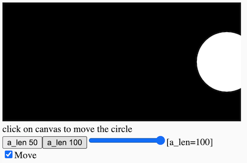

# 3. Interaction: Conditionals

[](https://editor.p5js.org/jht1493/sketches/hV0JF0uwo)

<!-- 
Interaction: Conditionals -> Conditionals 
-->

<!-- 
https://docs.google.com/document/d/14iC_LoImN-RUQumYrOLWjEk24q-KXBzEh0cJoN3Dy3I/edit
JHT Week 3 Worksheet
 -->

<!-- *The videos in this section were created ~2 years ago. They use different editors for p5.js. All of the concepts should still apply, however, there are some minor changes. Most notably in JavaScript `let` is now the preferred way to declare a variable over `var`. If you would like to learn more about this you can [watch this video about let vs var](https://youtu.be/q8SHaDQdul0).* -->

<!-- >> ?? move this comment to video page -->
<!-- >> ?? recommend reading before watching videos -->
<!-- >> guided copy-and-paster: re-mix is ok, start with best practices -->

## Conditional Statements
* [video 3.1: Introduction to Conditional Statements ](https://thecodingtrain.com/beginners/p5js/3.1-conditional-statements.html) (~12 min)
  * `if` statement
  * relational operators (`>`, `<`, `<=`, `>=`, `==`, `===`, `!==`)
  * [sketch - if mouseX](https://editor.p5js.org/codingtrain/sketches/z_yjYIha)
* [video 3.2: Bouncing Ball](https://thecodingtrain.com/beginners/p5js/3.2-bouncing-ball.html) (~8 min)
  * [sketch - bouncing ball x](https://editor.p5js.org/codingtrain/sketches/Xm4cmQvU) <!-- >> does not bounce!! -->
  * [sketch - bouncing ball xy](https://editor.p5js.org/icm/sketches/BJKWv5Tn)
  <!-- >> bounces x and y -->
  <!-- >> simpler example that does with going off on left -->
  <!-- println -> console.log -->
* [video 3.3: else, else if, and, or](https://thecodingtrain.com/beginners/p5js/3.3-else-elseif-and-or.html) (~17 min)
  * [sketch - if mouseX](https://editor.p5js.org/codingtrain/sketches/In-bIB8w) <!-- * [sketch - if mouseX AND](https://editor.p5js.org/jht1493/sketches/pK7xE8hN3) -->
  * [sketch - else if](https://editor.p5js.org/jht1493/sketches/VmJD4ZUMJ)
  * [sketch - bounce ball x OR](https://editor.p5js.org/jht1493/sketches/G1WHVQsRV)
  * [sketch - bounce ball x OR ui](https://editor.p5js.org/jht1493/sketches/h0ZJWwOzb)
  <!-- code commented out in sketch -->
  <!-- mentions updating bounceing ball and other sketch -->
  <!-- else if not essential -->
  <!-- >> ?? add better example -->
  <!-- otherwise -->
* [video 3.4: Boolean variables](https://thecodingtrain.com/beginners/p5js/3.4-boolean-variables.html) (~20 min)
  <!-- * [sketch - Boolean variables](https://editor.p5js.org/codingtrain/sketches/yzBpV0CI) !!@ Does not match video -->
  * [sketch - Boolean variables](https://editor.p5js.org/jht1493/sketches/1IcyZZamQ)
  <!-- sketch correct to match video -->
  <!-- >> ?? no Boolean variables used in sketch -->
  <!-- mouseIsPressed variable
  // change state of program
  // toggle boolean value
  on = !on; -->

<!-- 3.1: Introduction to Conditional Statements - video tutorial -->
<!-- https://www.youtube.com/watch?v=1Osb_iGDdjk&list=PLRqwX-V7Uu6Zy51Q-x9tMWIv9cueOFTFA&index=10 -->
<!-- 3.2: Bouncing Ball - video tutorial -->
<!-- https://www.youtube.com/watch?v=LO3Awjn_gyU&list=PLRqwX-V7Uu6Zy51Q-x9tMWIv9cueOFTFA&index=11 -->
<!-- 3.3: `else`, `else if`, AND (`&&`), OR (`||`) - video tutorial -->
<!-- https://www.youtube.com/watch?v=r2S7j54I68c&list=PLRqwX-V7Uu6Zy51Q-x9tMWIv9cueOFTFA&index=12 -->
<!-- 3.4: Boolean variables - video tutorial -->
<!-- https://www.youtube.com/watch?v=Rk-_syQluvc&list=PLRqwX-V7Uu6Zy51Q-x9tMWIv9cueOFTFA&index=13 -->

## Getting Started with p5.js book
* Chapter 5. Response
  * [sketches](https://editor.p5js.org/jht1493/collections/u8b97q_m7)
* [Getting Started with p5.js book](http://amzn.to/2ckixCW) 
  * [Ebook (free with NYU Library login)](https://ebookcentral.proquest.com/lib/nyulibrary-ebooks/detail.action?docID=4333728) 
  * [git source code](https://github.com/lmccart/gswp5.js-code)


## GUI Interfaces
One way to practice working with conditionals is to try to code a common interface elements in the canvas: e.g. rollover, button, slider, etc. 
<!-- In [week 6](https://github.com/ITPNYU/ICM-2018/blob/master/weeks/06_dom.md) we'll compare this technique to using elements the browser provides for free. -->
- [sketch - circle rollover](https://editor.p5js.org/icm/sketches/H1kCSqah)
- [sketch - square rollover](https://editor.p5js.org/icm/sketches/rkLfL56h)
- [sketch - button hold down](https://editor.p5js.org/icm/sketches/S16-H9pn)
- [sketch - button switch](https://editor.p5js.org/icm/sketches/Sywrrqa2)
- [sketch - quadrant rollover](https://editor.p5js.org/icm/sketches/Hki1I5ah)
- [sketch - rollover with fade](https://editor.p5js.org/icm/sketches/SkPsHcph)
- [sketch - draggable](https://editor.p5js.org/icm/sketches/B13wH5T3)
- [sketch - knob](https://editor.p5js.org/icm/sketches/HkfFHcp2)
- [sketch - slider](https://editor.p5js.org/icm/sketches/H1LXU9ah)

<!-- >> some not easy to reuse this code. !!@ Drop ?? -->
<!-- better to show if and variables used with DOM -->

[](https://editor.p5js.org/jht1493/sketches/hV0JF0uwo)

-------------------------------------------------------------------------------
# 3. Recap, Explore and Experiment - Interaction: Conditionals

Let's recap, explore, and experiment with the concepts introduced in this session.

## Ex 3.1 Variables circleX

Recall from the last session we used a variable `circleX` to animate a circle moving across the screen.

```
  circle(circleX, 150, 64);
  circleX = circleX + 1;
```

[sketch - make your own variable](https://editor.p5js.org/codingtrain/sketches/xPXNdPy17)  

The remainder arithmetic operator % is use in this sketch to do the same thing, 
and have the animation wrap around when the circle passes the right edge of the screen.

```
  circleX = (circleX + 1) % width;
```

[sketch - 2.2.1 circleX width](https://editor.p5js.org/jht1493/sketches/CwYDz_4N2)   

In this sketch we replace the remainder arithmetic operator with an `if` statement to get the same effect.

```
  circleX = circleX + 1;
  if (circleX > width) {
    circleX = 0;
  }
```

When the variable `circleX` reaches a value greater than `width` it is set to zero.

[sketch - 3.1.1 variable circleX width if](https://editor.p5js.org/jht1493/sketches/NO5mWO62W)

Let's take a closer look at the `if` statement. It has two main parts, the **test** and the **body**. 
```
  if (**test**) {
    **body**
  }
```
The **body** is any number of statements that will be executed it the **test** is `true`.
Let's take a deeper look at what **test** are possible.
The syntax of the comparision is `a > b` where `a` can be any expression,
and `b` another expression. The expression is true if the value of `a` is greater than `b`. We can also test for `a` less than `b` with `a < b`.

We can use what we have seen with basic arithmetic to get some variations. In this script two circles move in opposite directions.

```
  circle1X = circle1X + 1;
  if (circle1X > width) {
    circle1X = 0;
  }
  circle2X = circle2X - 1;
  if (circle2X < 0) {
    circle2X = width;
  }
```

[sketch - 3.1.2 variable circle1X circle2X](https://editor.p5js.org/jht1493/sketches/UJjCwAFF0)

### > Try

- have the circles remain entirely with inside the canvas.

[sketch - 3.1.3 variable circle1X tight](https://editor.p5js.org/jht1493/sketches/b-pzyyNSU)

## Ex 3.2 Bouncing animation

To have the circle animate in a horizontally back and forth on the canvas we introduce a variable, `circleXspeed`, that controls the direction of the animation.

[sketch - 3.2 variable circleXspeed](https://editor.p5js.org/jht1493/sketches/TAV5p1sMW)

```
let circleXspeed = 1;
...
  circleX = circleX + circleXspeed;
  if (circleX > width) {
    circleXspeed = -1;
  }
  if (circleX < 0) {
    circleXspeed = 1;    
  }
```

When `circleXspeed` is 1, or any value greater than zero, the circle will move the right. When `circleXspeed` is -1, the circle will move to the left. It's helpfull to visualize the X-axis as a number line:  

|   |   |   |   |   |   |   |   |   |   |   |   |   |   |   |
|---|---|---|---|---|---|---|---|---|---|---|---|---|---|---|
|...| -2 | -1 | 0 | 1 | 2 | 3 | 4 | 5 | 6 | 7 | 8 | 9 | 10 | ...
<!-- |   |   |   |   |   |   |   | ^circleX  |   |   |   |   |   |   |   | -->

Adding positive values to variable `circleX` will move to the right,
adding negative values will move the to left.

 <!-- ... | -2 | -1 | 0 | 1 | 2 | 3 | 4 | 5 | 6 | 7 | 8 | 9 | 10 | 11 | 12 | 13 | 14 | 15 | 16 | 17 | 18 | .... -->

### > Try

- add two buttons to adjust the speed of animation

[sketch - 3.2 variable circleXspeed buttons](https://editor.p5js.org/jht1493/sketches/SvxAd4V3z)

### better bounce

- using negation and logical OR operator we can simplify the bounce script

```
  if (circleX > width || circleX < 0) {
    circleXspeed = - circleXspeed;    
  }
```
In pseudo-code (english like code) the `if` statement reads
> if the variable `circleX` is greater than the width of the canvas  
 OR less than the left edge of the canvas, do this:
> > change the sign of variable `circleXspeed` from positive to negative, or negative to positive

[sketch - 3.2 variable circleXspeed OR](https://editor.p5js.org/jht1493/sketches/PLfo2BKRm)

### > Try

- introduce a variable for the Y location and have the circle also travel top to bottom

[sketch - 3.2 variable circleXspeed scan](https://editor.p5js.org/jht1493/sketches/qcPdvN6nR)

### > Try

- add DOM elements to control one of your animated sketches.

## Ex 3.3 patterns 

In this exercise we'll explore creating patterns as you may see in textiles or wall papers. We will also apply randomness to get controlled variety. You can think of patterns as frozen imprints of the animations techniques we have used so far.

To repeatily execute statements we will use the `while` statement:

```
  while (**test**) {
    **body**
  }
```
The **body** is any number of statements that will be executed while the **test** is `true`. Of course me must make sure the **test** is `false` at some point otherwise the Browser will lockup and will have to close the page.

Repeatily drawing a simple shape can be done concisely using a variable and the `while` statement. In this sketch one row of a simple shape is drawn left to right on the canvas:

[sketch - 3.3. pattern while](https://editor.p5js.org/jht1493/sketches/QlAHBLxi8e)

```
  while (x < width) {
    console.log('x='+x+' y='+y+' len='+len);
    circle(x + 25, y + 25, len-10);
    rect(x, y, len, len);
    x = x + len;
  }
```

Compare this sketch to the previous sketches that produce animations. You'll should note that there is no `draw` function in this sketch. All drawing is done in the `setup` function.

### > Try

- modify the sketch to have the drawing fill the canvas
  - hint: add code to modify the `y` variable and test it against the canvas `height` variable

[sketch - 3.3. pattern while y](https://editor.p5js.org/jht1493/sketches/S9YsVD9gV)

### > Try

- modify the previous sketch to consolate the drawing code into a user defined function

[sketch - 3.3. pattern while drawShape1](https://editor.p5js.org/jht1493/sketches/cA_XRhYnI)

### > Try

- modify the previous sketch to use randomness and your user defined function to create some variety

[sketch - 3.3. pattern while random](https://editor.p5js.org/jht1493/sketches/JM1F5XmJuJ)

[sketch - 3.3. pattern while random 2](https://editor.p5js.org/jht1493/sketches/44dcLkWoC)

[sketch - 3.3. pattern while 3](https://editor.p5js.org/jht1493/sketches/vqy_zDixd)

[sketch - 3.3. pattern while 4](https://editor.p5js.org/jht1493/sketches/_TkkjoNrW)

## Ex 3.4 revealing the invisible

Let's explore using the slider and checkbox DOM elements to control and display variables. We can do quick experiments by commenting out code and manually changing the initial value of variables. But as we honing in on a range of setting and blocks of code the we want to play with it's often more convient to create a few DOM elements to allow us to explore with a few clicks.

<!-- ## Ex 3.3 playing with animation: sliders and checkbox -->

<!-- > buttons to set variables  
> check box for boolean variables  
> sliders for numerical variables  
> span to display variables  

use DOM to make variables visible   -->

[](https://editor.p5js.org/jht1493/sketches/qBt6Ty_7b)  
[sketch - 3.4 circleX a_len ui](https://editor.p5js.org/jht1493/sketches/qBt6Ty_7b)

### checkBox for boolean variable

The DOM checkBox element is the natural way to set and display a boolean variable.
In this example the boolean variable `a_move` is used to control the animation. If it is `true` the animation will run, otherwise there is no movement. Here are the steps to connect a variable to a checkBox DOM element.

#### 1. declare the boolean variable

The variable is declared and given an initial value.

```
let a_move = true;
```

#### 2. use the boolean variable 

For example, the `if` statement to control the action.

```
  if (a_move) {
    circleX = (circleX + 1) % width;
  }
```

#### 3. connect the variable to the checkbox

At `setup` time use `createCheckbox` to create the checkBox, give it a label, give it an initial value, and code to run to update the variable.

```
  // createCheckbox([label], [value])
  createCheckbox('move', a_move).changed(function() {
    a_move = this.checked();
  });
```

### slider for numeric variable

The buttons, sliders, and span can be used to control and display a numeric variable. In this example the variable `a_len` determines the diameter of the circle. Here are the steps to connect the variable to a pan for display, buttons to set it to a specific value, and a slider to allow it to be set to a value in a range.

#### 1. declare the variable

The variable is declared and given an initial value.

```
let a_len = 64;
```

#### 2. use the value

```
  circle(circleX, circleY, a_len);
```

#### 3. set the variable to a specific value

```
  createButton('a_len 50').mousePressed(function() {
    a_len = 50;
  });
```

#### 4. connect the variable to a slider

```
  // createSlider(min, max, [value], [step])
  createSlider(0, 200, a_len).input(function() {
    a_len = this.value();
  });
```

#### 5. use a span to display the variable

- use `createSpan` to create the span and name it 

```
  createSpan().id('ia_len');
```

- at `draw` time use `select` to  update the span with a labeled value from the variable

```
  select('#ia_len').html('[a_len=' + a_len + '] ')
```

### > Try

- add DOM elements to display other variable in the previous sketch

[sketch - 3.4 circleX ui more](https://editor.p5js.org/jht1493/sketches/uGy4cEzbs)

# Your toolbox

## Composition

> statements  
> expressions  
> user defined functions  
> translating from english --> pseudo-code --> p5js code  

## Javascript Syntax and Grammar

## assignment syntax

> `let` **your_var** `=` **inital_value**`;`  
> **your_var** `=` **new_value**`;`  
> **your_var** `+=` **increment**`;`  
> **your_var** `++`;  

> global variables  
> local variables  
> parameter variables  

## Value expressions

numbers  
booleans  
strings  
arrays  
objects  

## Arithmetic operators

`a` **Arithmetic-operator** `b`

| Syntax | Arithmetic-operator |
|---| ---- |
| `a + b` | Addition |
| `a − b` | Subtraction |
| `a * b` | Multiplication |
| `a / b` | Division |

### Negation

| Syntax | Negation |
|---| ---- |
| - a | Negation |

Same as `-1 * a`

## if-test syntax

```
  if (**test**) {
    **body**
  }
```

```
  if (**test**) {
    **body**
  }
  else {
    **body**
  }
```

## while-loop syntax

```
  while (**test**) {
    **body**
  }
```

## relational operators

A **test** is any `boolean` expression, an expression that produces a `true` or `false` value. The comparison operators will produce a `boolean` expression by comparing any two values.

### Syntax for relational operators

`a` **relational-operator** `b`

| Syntax |   relational-operator |
|---| ---- |
| a > b | Greater than |
| a < b | Less than |
| a >= b | Greater than or equal to |
| a <= b | Less than or equal to |
| a == b | Equal to |
| a != b | Not Equal to |
| a === b | Strict Equal to  |
| a !== b | Strict Not Equal to  |


## AND logical operator

|  a   |   b |  a && b  |
| ---- | ---- | ----- |
| `false` | `false` | `false` |
| `false` | `true` | `false` |
| `true` | `false` | `false` |
| `true` | `true` | `true` |

## OR logical operator

|  a   |   b |  a &#124;&#124; b  |
| ---- | ---- | ----- |
| `false` | `false` | `false` |
| `false` | `true` | `true` |
| `true` | `false` | `true` |
| `true` | `true` | `true` |

# Your aides

> understand you took box (syntax), what's possible  
> pseudo-code  
> visual plan  
> debugging with console.log  
> debugging with DOM  
> steps of creating an algorithm  
> https://en.wikipedia.org/wiki/Algorithm  
>> flow chart  
>> pseudo-code  
>> experiment  
>> state tables   

> break down if  
> boolean expresssion  
> flow   
 
> [] !!@ TODO  
> need to develop algorithm   
> process that must be expressed in operations on variables over time  
> need to visualize state and time  
> pseudo-code -> comments  

> boolean tables AND OR NOT
> breaking long expressions with temp variables  
> your code as a story with characters (variables)   
> script is the code in sketch -- plot line -- time  
> characters can only say one told to remember one thing  
> and asked to repeat it  

> intro `while` as way to draw entire frame on each draw call  

-------------------------------------------------------------------------------
## Getting Started with p5.js book sketches

Sketches from the [Getting Started book](http://amzn.to/2ckixCW).  
You are invited to remix and combine them to further explore.

- Chapter 5 Response

[Ex_05_01 frameCount](https://editor.p5js.org/jht1493/sketches/QrE5pO6E9)  
[Ex_05_02 setup draw](https://editor.p5js.org/jht1493/sketches/rts0Rja8o)  
[Ex_05_03 setup, Meet draw](https://editor.p5js.org/jht1493/sketches/T04uHthwa)  
[Ex_05_04 Track the Mouse](https://editor.p5js.org/jht1493/sketches/4pysTdayc)  
[Ex_05_05 The Dot Follows You](https://editor.p5js.org/jht1493/sketches/rc_stJwOF)  
[Ex_05_06 Draw Continuously](https://editor.p5js.org/jht1493/sketches/d2VusUGT4)  
[Ex_05_07 Set Thickness on the Fly](https://editor.p5js.org/jht1493/sketches/H9EaSl2Sh)  
[Ex_05_08 Easing Does It](https://editor.p5js.org/jht1493/sketches/kdszl3wkF)  
[Ex_05_09 Smooth Lines with Easing](https://editor.p5js.org/jht1493/sketches/TZ5FwWXoW)  
[Ex_05_10 Click the Mouse](https://editor.p5js.org/jht1493/sketches/ptw9C5yOQ)  
[Ex_05_11 Detect When Not Clicked](https://editor.p5js.org/jht1493/sketches/hV0JF0uwo)  
[Ex_05_12 Multiple Mouse Buttons](https://editor.p5js.org/jht1493/sketches/PQdxi8L_T)  
[Ex_05_13 Find the Cursor](https://editor.p5js.org/jht1493/sketches/Im7tJDFJM)  
[Ex_05_14 The Bounds of a Circle](https://editor.p5js.org/jht1493/sketches/tPX6MmuEk)  
[Ex_05_14 The Bounds of a Circle pulse](https://editor.p5js.org/jht1493/sketches/nPTnXZD3c) -remix-  
[Ex_05_14 The Bounds of a Circle obj](https://editor.p5js.org/jht1493/sketches/ctwjs9TcL) -remix-  
[Ex_05_15 The Bounds of a Rectangle](https://editor.p5js.org/jht1493/sketches/MV2Ifxtaz)  
[Ex_05_16 Tap a Key](https://editor.p5js.org/jht1493/sketches/UNsRwHJVQ)  
[Ex_05_17 Draw Some Letters](https://editor.p5js.org/jht1493/sketches/vdHJ835F4)  
[Ex_05_18 Check for Specific Keys](https://editor.p5js.org/jht1493/sketches/HQ4rz3iDt)  
[Ex_05_19 Move with Arrow Keys](https://editor.p5js.org/jht1493/sketches/kbaJEPxF5)  
[Ex_05_20 Touch the Screen](https://editor.p5js.org/jht1493/sketches/ZnKfzbW_c)  
[Ex_05_21 Track the Finger](https://editor.p5js.org/jht1493/sketches/yh4waikxd)  
[Ex_05_22 Map Values to a Range](https://editor.p5js.org/jht1493/sketches/BglFnxl3U)  
[Ex_05_23 Map with the map Function](https://editor.p5js.org/jht1493/sketches/AtqCFY7CC)  
[Ex_05_99 Robot03_Response](https://editor.p5js.org/jht1493/sketches/sWEVGT4bm)  

[](https://editor.p5js.org/jht1493/sketches/t0APMYmVw)
