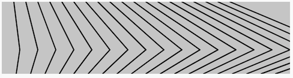
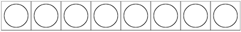
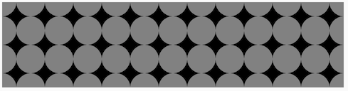
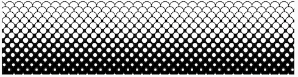

# Repetition: Loops

[](https://editor.p5js.org/jht1493/sketches/o_7ocEFZ8)

<!-- 
> Arrays intro here.  
> Object literal  
> Toolbox  
> Explore patterns with func 
-->

<!-- Repeated from objects -->
<!-- ## Arrays
* [video - 7.1 What is an array?](https://thecodingtrain.com/beginners/p5js/7.1-what-is-an-array.html) (~14 min)  
    - [sketch - click for next word](https://editor.p5js.org/codingtrain/sketches/DmwVbhOZ)
* [video - 7.2 Arrays and loops](https://thecodingtrain.com/beginners/p5js/7.2-arrays-loops.html) (~9 min)  
  - [sketch - circles from array](https://editor.p5js.org/codingtrain/sketches/ZnPevren)
-->
<!-- !!@ Update to use let -->


<!-- 
https://docs.google.com/document/d/117Uk1eSS9yzf-H35RXndyp2o3l9c-w95cs7Cum79QN0/edit
JHT Week 4 Worksheet
 -->

## Loops (while and for)
* [video 4.1: `while` and `for`](https://thecodingtrain.com/beginners/p5js/4.1-while-for.html
) (~14 min)
  * [sketch - while for ](https://editor.p5js.org/codingtrain/sketches/1B6jhzI6)
* [video 4.2: nested loops](https://thecodingtrain.com/beginners/p5js/4.2-nested-loops.html) (~10 min)
  * [sketch - nested loops](https://editor.p5js.org/codingtrain/sketches/nxJTfiJd)

## Arrays
* [video - 7.1 What is an array?](https://thecodingtrain.com/beginners/p5js/7.1-what-is-an-array.html) (~14 min)  
    - [sketch - click for next word](https://editor.p5js.org/codingtrain/sketches/DmwVbhOZ)
* [video - 7.2 Arrays and loops](https://thecodingtrain.com/beginners/p5js/7.2-arrays-loops.html) (~9 min)  
  - [sketch - circles from array](https://editor.p5js.org/codingtrain/sketches/ZnPevren)

<!-- * [4.1: `while` and `for` - video tutorial](https://www.youtube.com/watch?v=cnRD9o6odjk&list=PLRqwX-V7Uu6Zy51Q-x9tMWIv9cueOFTFA&index=14) -->
<!-- * [4.2: nested loops - video tutorial](https://www.youtube.com/watch?v=1c1_TMdf8b8&list=PLRqwX-V7Uu6Zy51Q-x9tMWIv9cueOFTFA&index=15) -->


<!-- ## Getting Started with p5.js book
*  Chapter 4.5-4.13 of [Getting Started with p5.js book](http://amzn.to/2ckixCW) | [Ebook (free with NYU Library login)](https://ebookcentral.proquest.com/lib/nyulibrary-ebooks/detail.action?docID=4333728) | [Code](https://github.com/lmccart/gswp5.js-code) -->
## Getting Started with p5.js book
*  Chapter 4 Variables 4.5-4.13
  * [sketches](https://editor.p5js.org/jht1493/collections/yH3IYcxzz)
  * [Getting Started with p5.js book](http://amzn.to/2ckixCW) 
    * [Ebook (free with NYU Library login)](https://ebookcentral.proquest.com/lib/nyulibrary-ebooks/detail.action?docID=4333728) 
    * [git source code](https://github.com/lmccart/gswp5.js-code)
-  Chapter 11 Arrays
    - [sketches](https://editor.p5js.org/jht1493/collections/GdOUniOjF)

## book - Code as Creative Medium 
  * Part One: Iterative Pattern
    * [Code as Creative Medium](https://www.amazon.com/gp/product/0262542048)

## 10PRINT
* [book - 10 PRINT CHR$(205.5+RND(1)); : GOTO 10](https://10print.org)
* [10PRINT Coding Challenge video](https://youtu.be/bEyTZ5ZZxZs)
  * [sketch - 10PRINT code example](https://editor.p5js.org/icm/sketches/rkHKL962)
<!-- >> !!@ Does NOT use for loop -->
<!-- >> convert to while-loop version -->

* Tutorial: [Recode Metaesquema by Hélio Oiticica](https://github.com/itpresidents/icm-help-sessions-2020/blob/master/session-04/session-04-example.md)

[](https://editor.p5js.org/jht1493/sketches/o_7ocEFZ8)

-------------------------------------------------------------------------------
# 4. Recap, Explore and Experiment - Repetition: Loops

## Ex 4.1 patterns 

In this exercise we'll explore creating patterns as seen in textiles or wall papers. We will also apply randomness to get variety. You can think of patterns as frozen imprints of the animations techniques we have used so far.

To repeatedly execute statements we will use the `while` statement:

```
  while (**test**) {
    **statements**
  }
```
Any number of **statements**  that will be executed while the **test** is `true`. We must make sure the **test** is `false` at some point otherwise the Browser will lockup and will have to close the page.

Drawing a simple shape across the canvas can be done concisely using a variable and the `while` statement. In this sketch one row of a simple shape is drawn left to right on the canvas:

[](https://editor.p5js.org/jht1493/sketches/QlAHBLxi8e)

[sketch - 4.1 pattern while](https://editor.p5js.org/jht1493/sketches/QlAHBLxi8e)

```
  while (x < width) {
    console.log('x='+x+' y='+y+' len='+len);
    circle(x + 25, y + 25, len-10);
    rect(x, y, len, len);
    x = x + len;
  }
```

Compare this sketch to the previous sketches that produce animations. You'll should note that there is no `draw` function in this sketch. All drawing is done in the `setup` function.

### > Try

- modify the sketch to fill the canvas with the shape.
  - hint: add code to modify the `y` variable and test it against the canvas `height` variable

[sketch - 4.1 pattern y](https://editor.p5js.org/jht1493/sketches/S9YsVD9gV)

### > Try

- modify the previous sketch to consolate the drawing code into a user defined function

[sketch - 4.1 pattern drawShape1](https://editor.p5js.org/jht1493/sketches/cA_XRhYnI)

### > Try

- modify the previous sketch to use randomness and your user defined function to create a variety of patterns

[sketch - 4.1 pattern random 1](https://editor.p5js.org/jht1493/sketches/JM1F5XmJuJ)

[sketch - 4.1 pattern random 2](https://editor.p5js.org/jht1493/sketches/44dcLkWoC)

[sketch - 4.1 pattern random 3](https://editor.p5js.org/jht1493/sketches/vqy_zDixd)

[sketch - 4.1 pattern random 4](https://editor.p5js.org/jht1493/sketches/_TkkjoNrW)

## Ex 4.2 for-loops

Another way repeatedly execute statements is the `for` statement, where the critical pieces of code the affect the loop are grouped together.

```
  for (**initialize**; **test**; **change**) {
    **statements**
  }
```

The **initialize** code is execute once. While the **test** is `true` the **statements** are executed, followed by the **change** code.  

For example:

```
  for (let x = 0;  x < 5; x += 1) {
    console.log('x='+x);
  }
```

Here the variable `x` will take on values 0, 1, 2, 3, 4.

### > Try

Write your own for-loop that draws a repeating shape on one row of the canvas.

[sketch - 4.2 for-loop](https://editor.p5js.org/jht1493/sketches/xlkU2_AlE)

### > Try

Organize your shape into a user defined function and have it fill the canvas using for-loops.

[sketch - 4.2 for-loop drawShape1](https://editor.p5js.org/jht1493/sketches/ZRMgh5oWA)


### > Try

Add some randomness.

[sketch - 4.2 for-loop random](https://editor.p5js.org/jht1493/sketches/cV8HNKv_D)


## Ex 4.3 arrays


<!-- 
array[index]

arr.length

adding to an array
arr.push(x)
arr[arr.length] = x

multiple arrays
xLocs[]
yLocs[]

 -->


-------------------------------------------------------------------------------
## Getting Started with p5.js book sketches

Sketches from the [Getting Started book](http://amzn.to/2ckixCW).  
You are invited to remix and combine them to further explore.
 
- Chapter 4 Variables

[Ex_04_05 Do the Same](https://editor.p5js.org/jht1493/sketches/nUqcuwlY9)  
[Ex_04_06 Use a for Loop](https://editor.p5js.org/jht1493/sketches/h0eBcXsIC)  
[Ex_04_07 Flex Your for Loop’s](https://editor.p5js.org/jht1493/sketches/oVh1WhBVI)  
[Ex_04_08 Fanning Out the Lines](https://editor.p5js.org/jht1493/sketches/Zxxj1cjH9)  
[Ex_04_09 Kinking the Lines](https://editor.p5js.org/jht1493/sketches/o_7ocEFZ8)  
[Ex_04_10 Embed for Loop](https://editor.p5js.org/jht1493/sketches/bFe6Hk45R)  
[Ex_04_11 Rows and Columns](https://editor.p5js.org/jht1493/sketches/SemvF_Fht)  
[Ex_04_12 Pins and Lines](https://editor.p5js.org/jht1493/sketches/u15OM3OHP)  
[Ex_04_13 Halftone Dots](https://editor.p5js.org/jht1493/sketches/GO50HlzHN)  
[Ex_04_99 Robot 2: Variables](https://editor.p5js.org/jht1493/sketches/mJ_X4q47O)  
[Ex_04_99 Robot 2: Variable func](https://editor.p5js.org/jht1493/sketches/cyyCJGXOz)  
[Ex_04_99 Robot 2: func jiggle](https://editor.p5js.org/jht1493/sketches/D3QUVpQhx)  

[](https://editor.p5js.org/jht1493/sketches/bFe6Hk45R)
[](https://editor.p5js.org/jht1493/sketches/kEyYmVtg-)
