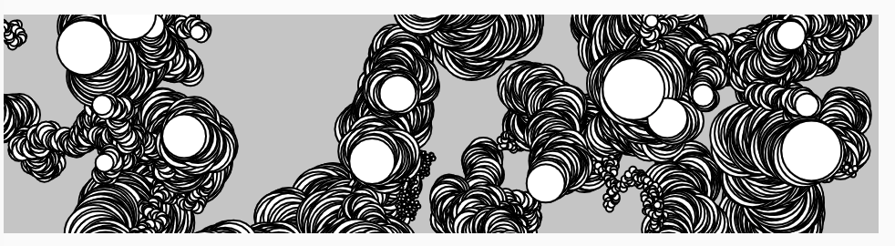
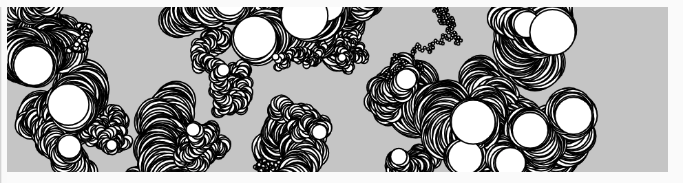
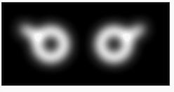
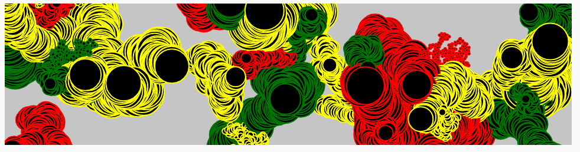

# Scale: Objects and Arrays
<!-- Objects and Array -> ES6 OOP Classes -->
<!-- Some of the videos in this section were created last year and some two years ago. They use different editors for p5.js. All of the concepts should still apply, however, there are some minor changes. If you notice something way off, please let Dan know! -->

## Object-Oriented Programming with Classes in JavaScript

* [video -  6.1 Intro to ES6 OOP](https://thecodingtrain.com/beginners/p5js/6.1-opp-intro.html) (~2 min)  

* [video - 6.2 Writing a Class](https://thecodingtrain.com/beginners/p5js/6.2-classes.html) (~20 min)  
  - [sketch - two bubbles same size](https://editor.p5js.org/codingtrain/sketches/qi7N4LWq)

<!-- -->

* [video - 6.3 Constructor Arguments](https://thecodingtrain.com/beginners/p5js/6.3-constructor-arguments.html) (~8 min)

  - [sketch - two bubbles different size](https://editor.p5js.org/codingtrain/sketches/HZG-lnyR)
  - [sketch - Two Gravity Ball Objects](https://editor.p5js.org/icm4.0/sketches/vshTFC6kU)  

<!-- https://editor.p5js.org/icm4.0/sketches/vshTFC6kU   -->
<!-- // 2020-10-11 jht: Corrected bounce test, comments   -->
<!-- https://editor.p5js.org/jht1493/sketches/vA7I6jRfY   -->
<!-- gravity ball two objects 1 POJO -->

#### Written Tutorials

* [Learning Processing Chapter 8 on Objects translated to p5](https://shiffman.github.io/Learning-p5.js/ch08.html)
<!-- https://shiffman.github.io/Learning-p5.js/ch08.html#ch08fig05 -- java syntax -->

* [Mozilla Classes reference](https://developer.mozilla.org/en-US/docs/Web/JavaScript/Reference/Classes)
<!-- Is this useful? Too much? -->

## Arrays

<!-- !!@ arrays introduced with loops -->
* [video - 7.1 What is an array?](https://thecodingtrain.com/beginners/p5js/7.1-what-is-an-array.html) (~14 min)

    - [sketch - click for next word](https://editor.p5js.org/codingtrain/sketches/DmwVbhOZ)

<!-- -->

* [video - 7.2 Arrays and loops](https://thecodingtrain.com/beginners/p5js/7.2-arrays-loops.html) (~9 min)  

  - [sketch - circles from array](https://editor.p5js.org/codingtrain/sketches/ZnPevren)

  <!-- !!@ Update to use let -->

* [video - 7.3 Arrays of objects](https://thecodingtrain.com/beginners/p5js/7.3-array-of-objects.html) (~15 min)  
  - [sketch - drag mouse for bubbles](https://editor.p5js.org/codingtrain/sketches/1y_xfueO)
  - [sketch - A Snake Following the Mouse](https://editor.p5js.org/icm/sketches/BkBsybb5X)
  
- [Extra video tutorial: for...of loop](https://youtu.be/Y8sMnRQYr3c?list=PLRqwX-V7Uu6Zy51Q-x9tMWIv9cueOFTFA) (~4 min)
  - [sketch - Array for-of bubbles](https://editor.p5js.org/jht1493/sketches/utpzYq_O8)

## Arrays of Objects

* [video - 7.4 Mouse interaction with objects](https://thecodingtrain.com/beginners/p5js/7.4-mouse-interaction.html) (~15 min)    
  - [sketch - bubbles click to turn gray](https://editor.p5js.org/codingtrain/sketches/lE4ypFpI)

* [video - 7.5 Removing objects from arrays](https://thecodingtrain.com/beginners/p5js/7.5-removing-objects-from-array.html) (~19 min)
  - [sketch - click to remove bubble](https://editor.p5js.org/codingtrain/sketches/smC4Jedi)
  - [sketch - drag trail of n bubbles](https://editor.p5js.org/codingtrain/sketches/9Ve9S6Mx)
  - [sketch - Interactive Stripes](http://editor.p5js.org/icm/sketches/B1ja76khW) 
  - [sketch - An Array of Buttons](http://editor.p5js.org/icm/sketches/BkaTNak3Z)
<!-- stripe.js./button.js !!@ consider put in sketch.js Easier to follow -->

## Object "communication"

* [video - 7.6: Object Communication Part 1](https://thecodingtrain.com/beginners/p5js/7.6-object-communication-1.html) (~14 min)  
  - [sketch - drag bubble over small bubble](https://editor.p5js.org/codingtrain/sketches/OG-_2K16)

* [video - 7.7: Object Communication Part 2](https://thecodingtrain.com/beginners/p5js/7.7-object-communication-2.html) (~19 min)  
  - [sketch - many bubbles touch react](https://editor.p5js.org/codingtrain/sketches/7SjPmXN2)
  - [sketch - Checking Objects Intersection](http://editor.p5js.org/icm/sketches/S1BbBT13b)

<!-- ## Getting Started with p5.js book
*  Chapters 10 and 11 of [Getting Started with p5.js book](http://amzn.to/2ckixCW) | [Ebook (free with NYU Library login)](https://ebookcentral.proquest.com/lib/nyulibrary-ebooks/detail.action?docID=4333728) | [Code](https://github.com/lmccart/gswp5.js-code) -->

## Getting Started with p5.js book

- [Getting Started with p5.js book](http://amzn.to/2ckixCW) 
-  Chapter 10 Objects
    - [sketches](https://editor.p5js.org/jht1493/collections/Un1cgr7lW)

-  Chapter 11 Arrays
    - [sketches](https://editor.p5js.org/jht1493/collections/GdOUniOjF)

### Going Further

#### Images and Objects

* [7.8: Objects and Images - video tutorial](https://thecodingtrain.com/beginners/p5js/7.8-objects-and-images.html) (~17 min)  

  - [sketch - MousePressed Adding New Images](http://editor.p5js.org/icm/sketches/SJzKEak3W)

* Tutorial. [The pixel array: Pushin Pusheen Pixels](https://github.com/itpresidents/icm-help-sessions-2020/blob/master/session-06/session-06-example.md)

#### Particle Systems
* [video - Particle System](https://thecodingtrain.com/CodingChallenges/078-simple-particle-system.html) (~14 min)
  - [sketch - Particle System](https://editor.p5js.org/codingtrain/sketches/D4ty3DgZB)
<!-- 
https://youtu.be/UcdigVaIYAk
https://editor.p5js.org/icm/sketches/B1d5xfS5X
-->
* [video - Snowfall](https://thecodingtrain.com/CodingChallenges/088-snowfall.html)
  - [sketch - Snowfall](https://editor.p5js.org/codingtrain/sketches/UMUPBVuH5) (~53 min)
<!-- !!@ fails 
https://editor.p5js.org/icm/sketches/HkICgMSqQ
https://youtu.be/cl-mHFCGzYk
-->

-------------------------------------------------------------------------------
# 6. Recap, Explore and Experiment - Objects and Arrays

>> [] !!@ TODO

-------------------------------------------------------------------------------
## Getting Started with p5.js book sketches

Sketches from the [Getting Started book](http://amzn.to/2ckixCW) 
You are invited to remix and combine them to further explore.

- Chapter 10 Objects

[Ex_10_01 Make an Object](https://editor.p5js.org/jht1493/sketches/ls9cxovWM)  
[Ex_10_02 Make Multiple Objects](https://editor.p5js.org/jht1493/sketches/K7PhkMWVi)  
[Ex_10_99 Robot Object](https://editor.p5js.org/jht1493/sketches/8s8si6CU9)  

- Chapter 11 Arrays

[Ex_11_01 Many Variables](https://editor.p5js.org/jht1493/sketches/W26Y1uuiu)  
[Ex_11_02 Too Many Variables](https://editor.p5js.org/jht1493/sketches/WNdXMzR_Q)  
[Ex_11_03 Arrays, Not Variables](https://editor.p5js.org/jht1493/sketches/mJyTluseZ)  
[Ex_11_04 Declare and Assign an Array](https://editor.p5js.org/jht1493/sketches/FghpP9uDR)  
[Ex_11_05 Assigning to an Array in One Go](https://editor.p5js.org/jht1493/sketches/n3apYawMJ)  
[Ex_11_06 Revisiting the First Example](https://editor.p5js.org/jht1493/sketches/WSHfHkoyV)  
[Ex_11_07 Filling an Array in a for Loop](https://editor.p5js.org/jht1493/sketches/BjH5BkIjj)  
[Ex_11_08 Track Mouse Movements](https://editor.p5js.org/jht1493/sketches/pVd3PT6U3)  
[Ex_11_09 Managing Many Objects](https://editor.p5js.org/jht1493/sketches/XDfmnW1JD)  
[Ex_11_10 Sequences of Images](https://editor.p5js.org/jht1493/sketches/-XbD5Gw0a)  
[Ex_11_99 Robot Array](https://editor.p5js.org/jht1493/sketches/dO-IXUHhr)

 

